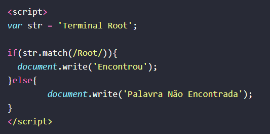

# Javascript

* CORRIGIR UMA PALAVRA STRING👩🏾‍💻

* script Esta tag HTML é usada para incorporar scripts, como JavaScript, no documento HTML. Qualquer código JavaScript dentro desta tag será executado pelo navegador da web.
* var str 'Terminal Root'; : Esta linha declara uma variável chamada "str" e atribui a ela o valor 'Terminal Root', que é uma string.
* var str = str.replace("Root", "Linux");: Aqui, o método replace() é chamado na variável "str". Este método substitui todas as ocorrências do primeiro argumento ("Root") pelo segundo argumento ("Linux") na string. O resultado da substituição é armazenado de volta na variável "str".
* document.write(str);: Este comando escreve o valor da variável "str" no documento HTML. Após a substituição feita pelo método replace(), o valor de "str" será 'Terminal Linux' e isso será escrito na página.

* ECONTRAR UMA PALAVRA NUMA STRING (case sensitive)

* script: Esta é uma tag HTML usada para incorporar scripts, como JavaScript, dentro de um documento HTML. Todo o código JavaScript dentro desta tag será interpretado e executado pelo navegador da web.
* var str = 'Terminal Root';: Esta linha declara uma variável chamada "str" e atribui a ela o valor 'Terminal Root', que é uma string.
* if(str.match(/Root/)){ ... }: Este é um bloco condicional em JavaScript. Ele verifica se a variável "str" contém a palavra "Root" usando a função match(). A função match() é usada para encontrar correspondências de padrões em uma string. No caso, estamos passando o padrão /Root/, que indica que queremos encontrar a palavra "Root" na string. Se a palavra "Root" for encontrada, o bloco de código dentro do if será executado.
* document.write('Encontrou');: Se a palavra "Root" for encontrada na variável "str", este comando escreve 'Encontrou' no documento HTML.
* else { document.write('Palavra Não Encontrada'); }: Este é o bloco de código que será executado se a condição dentro do if não for verdadeira. Neste caso, se a palavra "Root" não for encontrada na variável "str", este comando escreve 'Palavra Não Encontrada' no documento HTML.

